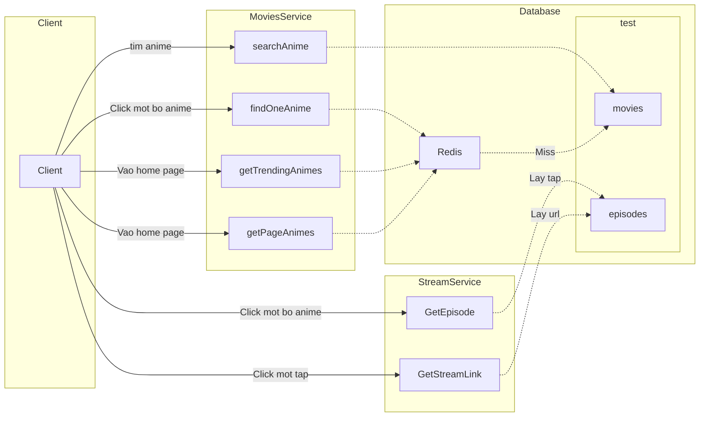

```mermaid
    graph LR
    subgraph Database
    subgraph test
    F[movies]
    K[episodes]
    end
    G[Redis]
    end
    subgraph MoviesService
    B[getTrendingAnimes]
    C[findOneAnime]
    D[getPageAnimes]
    E[searchAnime]
    end
    subgraph StreamService
    H[GetEpisode]
    J[GetStreamLink]
    end
    subgraph Client
    A[Client]
    end
    A-->|Vao home page| B & D
    A-->|tim anime| E
    A-->|Click mot bo anime| C & H
    A-->|Click mot tap| J
    C-.->G
    E-.->F
    B-.->G
    G-.->|Miss| F
    D-.->G
    H-.->|Lay tap|K
    J-.->|Lay url|K
```